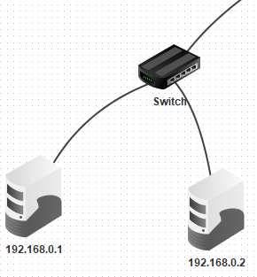
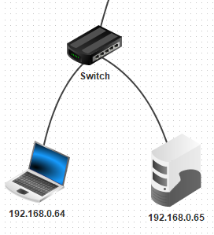
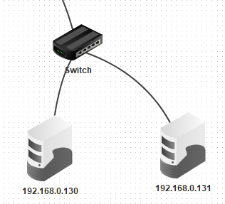
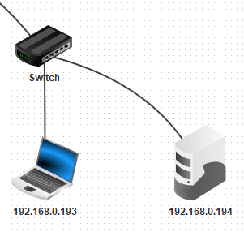

# Subnetting4

#### In questo esercizio dobbiamo fare la stessa cosa che abbiamo fatto negli esercizi precendeti ("Esemoio l'esercizio Subnetting").
#### In questo caso abbiamo 4 sottoreti e dobbiamo cercare di farle comunicare tra loro, come subnetmask usiamo 255.255.255.192

 Come possiamo vedere nella foto gli indirrizzi ip sono 192.168.0.1 e 192.168.0.2 perchè il range degli ip di questa rete va da 1 a 63 

 Nella seconda immagine invece vediamo che il range dell'ip cambia, infatti gli ip disponibili vanno da 64 a 129

 Nella terza immagine invece gli ip diponibili vanno da 130 a 192 

 Nell'ultima immagine gli ip disponibili sono quelli che vanno da 193 a 254

Per fare correttamente questo esercizio dobbiamo assegnare alla prima rete ip che sono compresi tra 1 e 63 nella seconda ip che sono compresi tra 64 a 129 nella terza rete ip compresi tra 130 e 192, nell'ultima invece ip compresi tra 193 e 254, tutti i pc devono avere come subnetmask 255.255.255.192
